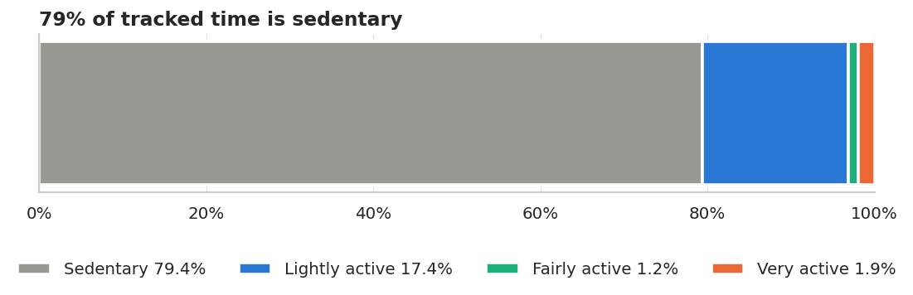
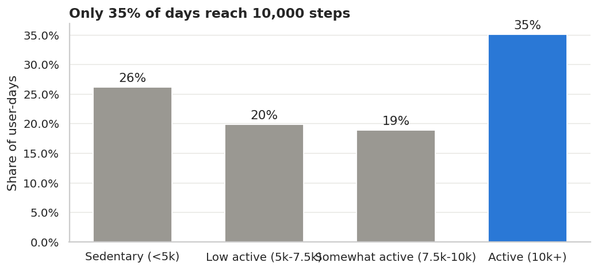
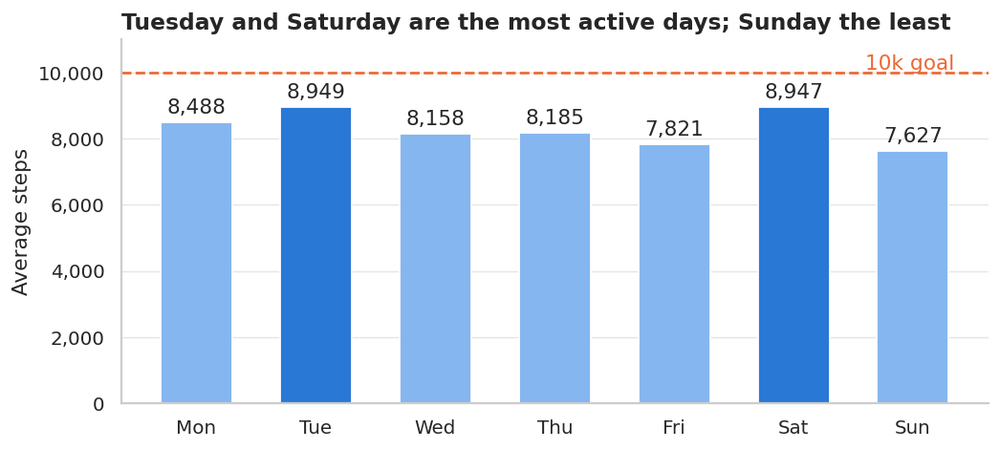
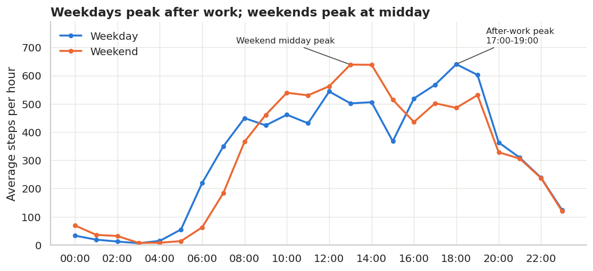
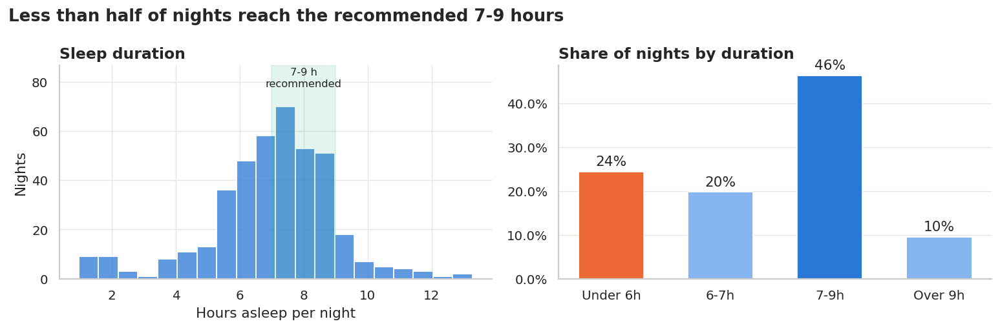
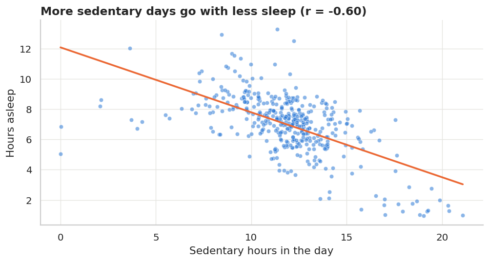
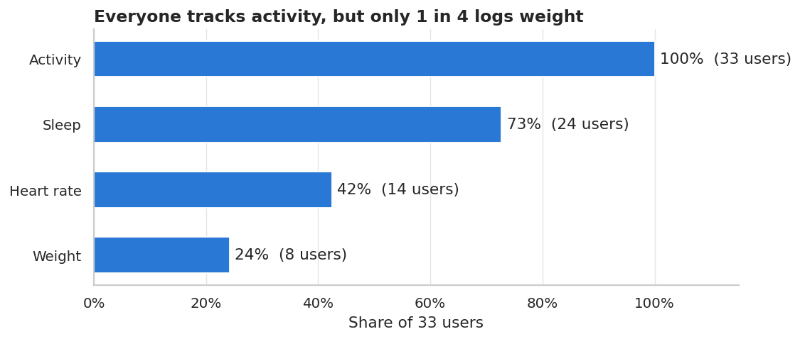
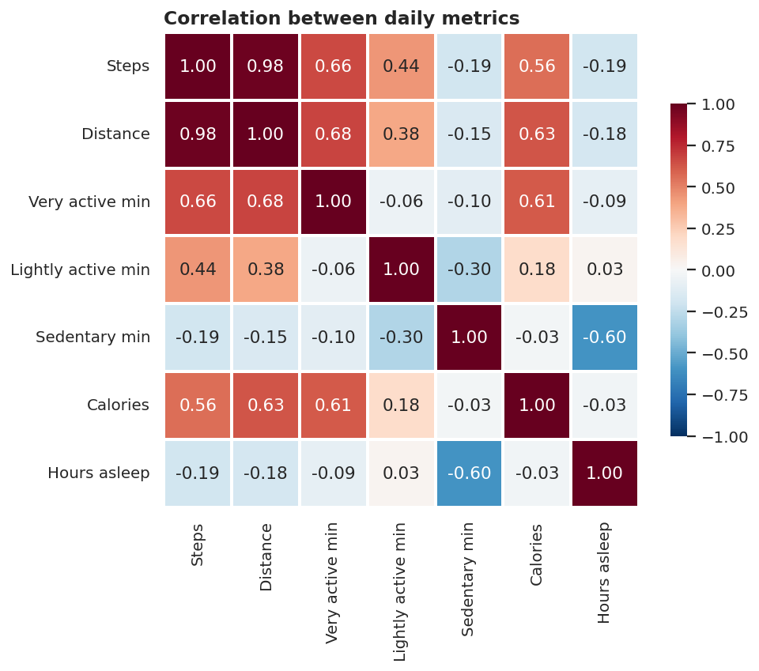
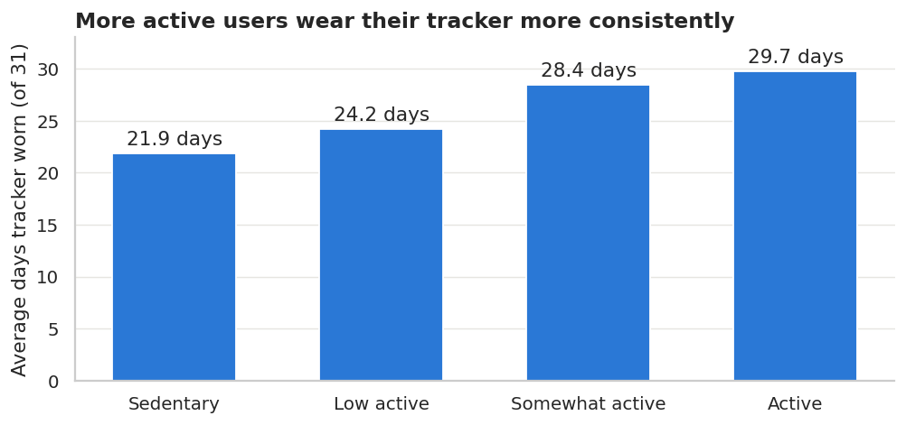

# Strava Fitness Data Analytics — Bellabeat Case Study

**How can a wellness technology company play it smart?**
This project analyses fitness-tracker data to understand how people use smart devices, then turns those patterns into marketing recommendations for **Bellabeat**, a wellness-technology company for women.

**Tools:** SQL (SQLite) · Python (pandas, Matplotlib, Seaborn, Plotly) · Streamlit

> Live app: _add your Streamlit Cloud link here_  ·  Video walkthrough: _add your video link here_

---

## 1. Business task

**Question:** How are consumers using their smart fitness devices, and how can these trends guide Bellabeat's marketing strategy?

| Stakeholder | Role |
|---|---|
| Urška Sršen | Co-founder and Chief Creative Officer (primary) |
| Sando Mur | Co-founder, executive team (primary) |
| Bellabeat marketing analytics team | Secondary |

**Deliverables:** (1) business task summary, (2) data sources, (3) cleaning documentation, (4) analysis summary, (5) visualisations and key findings, (6) top recommendations.

---

## 2. Data sources

| Item | Detail |
|---|---|
| Dataset | [FitBit Fitness Tracker Data](https://www.kaggle.com/datasets/arashnic/fitbit) by Möbius (Kaggle) |
| Licence | CC0 Public Domain |
| Original source | Amazon Mechanical Turk survey, Furberg et al. — DOI [10.5281/zenodo.53894](https://doi.org/10.5281/zenodo.53894) |
| Period used | 12 April – 12 May 2016 (31 days) |
| Users | 33 consenting FitBit users |
| Files | 18 CSVs (~405 MB), daily / hourly / minute / second level |

**Files used**

| File | Rows | Used for |
|---|---:|---|
| dailyActivity_merged | 940 | Main daily table (already contains dailyCalories, dailyIntensities and dailySteps) |
| sleepDay_merged | 413 | Nightly sleep |
| minuteSleep_merged | 188,521 | Bedtime and wake-up times |
| hourlySteps / hourlyCalories / hourlyIntensities | 22,099 each | Time-of-day patterns |
| heartrate_seconds_merged | 2,483,658 | Heart-rate patterns (too large for Excel) |
| weightLogInfo_merged | 67 | Weight / BMI (only 8 users) |

**ROCCC check**

| Criterion | Assessment |
|---|---|
| Reliable | Low: 33 users, and no age, sex or location data |
| Original | Low: third-party survey data, pre-processed |
| Comprehensive | Medium: many metrics, but uneven (24 users with sleep, 14 with heart rate, 8 with weight) |
| Current | Low: 2016 data |
| Cited | Yes: DOI and Kaggle source |

---

## 3. Data cleaning (SQL)

**Pipeline**

```
Data Files/*.csv  →  scripts/build_database.py  →  sql/01_data_cleaning.sql  →  database/strava_fitness.db
   (raw, 405 MB)      load + ISO timestamps          all cleaning rules            (clean, 3.3 MB)
```

Python only loads the CSVs and converts timestamps such as `4/12/2016 7:21:05 AM` to `2016-04-12 07:21:05`, because SQLite cannot parse that format. **Every cleaning rule is written in SQL** and logged in the `cleaning_log` table.

| Step | Table | Action | Before | After |
|---|---|---|---:|---:|
| 1 | daily activity | Checked for negative values and NULLs (none found) | 940 | 940 |
| 2 | daily_activity | Removed **non-wear days** (0 steps with ~24 h sedentary) | 940 | 863 |
| 3 | sleep_day | Removed **exact duplicate** rows | 413 | 410 |
| 4 | sleep_sessions | Removed 543 duplicate minute rows, grouped into sleep sessions | 188,521 | 459 sessions |
| 5 | weight_log | Dropped `Fat` (65 of 67 empty) and `WeightPounds` (duplicate of kg) | 67 | 67 |
| 6 | hourly_activity | Joined hourly steps, calories and intensity into one table | 22,099 | 22,099 |
| 7 | heart_rate_hourly | Aggregated 2.48M second-level readings to user-hour | 2,483,658 | 6,013 |
| 8 | daily_summary | Joined activity, sleep and heart rate per user-day | – | 863 |
| 9 | user_profile | One row per user with activity level and usage segments | – | 33 |

**Derived fields:** weekday, weekday/weekend, total active minutes, logged (wear) minutes, step band, sleep efficiency %, sleep band, bedtime hour, BMI category, user activity level and usage level.

---

## 4. Analysis summary

All 18 analysis queries are in [`sql/02_analysis_queries.sql`](sql/02_analysis_queries.sql) and run live on the **SQL analysis** page of the app. The EDA notebook is [`notebooks/strava_fitness_eda.ipynb`](notebooks/strava_fitness_eda.ipynb).

| Metric | Value |
|---|---:|
| Average daily steps | 8,319 |
| Days reaching 10,000 steps | 35% |
| Share of tracked time that is sedentary | 79% |
| Average sedentary time | 15.9 h/day |
| Average sleep | 7.0 h |
| Nights with 7–9 h sleep | 46% |
| Users meeting the WHO 150 min/week activity guideline | 19 of 33 |

---

## 5. Key findings

### 1. Users are mostly sedentary
79% of tracked time is sedentary. Lightly active time averages ~210 min/day, but fairly and very active time together is only ~38 min/day. Only 35% of days reach 10,000 steps.




### 2. Activity follows a clear weekly and daily rhythm
Tuesday (8,949) and Saturday (8,947) are the most active days, and Sunday (7,627) is the least. On weekdays, activity peaks after work (17:00–19:00). At weekends, it peaks at midday (12:00–14:00).




### 3. Many users do not get enough sleep
Average sleep is 7.0 h, but only 46% of nights reach the recommended 7–9 h, and 24% are under 6 h. Days with more sedentary time are linked to shorter sleep (r = −0.60). Most users go to bed between 22:00 and midnight.




*Caveat: this is a correlation. When the tracker is worn at night, time awake in bed may count as sedentary, which strengthens the link.*

### 4. Feature use drops as manual effort rises
Activity tracking is automatic and used by 100% of users. Sleep tracking is used by 73%, heart rate by 42%, and manual weight logging by only 24%.



### 5. Intensity matters more than step count for calories
Very active minutes correlate more strongly with calories (r = 0.61) than total steps do (r = 0.56).



### 6. Wear consistency is a problem
Only 47% of days are full 24-hour wear, and the number of active users fell from 33 in week 1 to 29 in week 4.



---

## 6. Recommendations for Bellabeat

| # | Insight | Recommendation |
|---|---|---|
| 1 | 79% of time is sedentary; only 35% of days hit 10k steps | **Movement nudges:** remind users after 60 minutes of inactivity, and set achievable step goals (e.g. 7,500) that build towards 10k. |
| 2 | Activity peaks 17:00–19:00 on weekdays and at midday at weekends | **Time campaigns and push notifications** just before these windows. |
| 3 | Sunday is the least active day | **Weekend challenges** and "Sunday reset" content. |
| 4 | Fewer than half of nights reach 7–9 h of sleep | **Sleep coaching:** a wind-down reminder around 22:00 and a combined activity + sleep score. |
| 5 | Manual features (weight) have the lowest adoption | **Reduce friction:** auto-sync with a smart scale, one-tap logging, and promote automatic features. |
| 6 | Half of days are not full-day wear, and use fades after ~3 weeks | **Market Leaf as comfortable 24/7 jewellery**, and use streaks, badges and monthly goals for retention. |

---

## 7. Limitations

- Small sample (33 users) with no demographic data. Bellabeat's customers are women, so these results are directional only.
- One month of data from 2016.
- The distance unit is not documented.
- Wear time varies between users and days.

**Next step:** validate with Bellabeat's own app data, which should be larger, more recent and include age and life-stage details.

---

## 8. Project structure

```
Strava Fitness/
├── Data Files/                  raw CSVs (not uploaded to GitHub, see below)
├── database/strava_fitness.db   clean SQLite database (3.3 MB)
├── sql/
│   ├── 01_data_cleaning.sql     all cleaning steps
│   └── 02_analysis_queries.sql  18 analysis queries
├── scripts/
│   ├── build_database.py        loads raw CSVs and runs the cleaning SQL
│   └── make_notebook.py         regenerates the EDA notebook
├── notebooks/strava_fitness_eda.ipynb   Matplotlib / Seaborn EDA
├── images/                      charts used in this README
├── streamlit_app.py             Streamlit dashboard + SQL analysis
├── requirements.txt
└── README.md
```

## 9. How to run

```bash
pip install -r requirements.txt

# (optional) rebuild the database from the raw CSVs in "Data Files/"
python scripts/build_database.py

# run the app
streamlit run streamlit_app.py
```

**App pages:** Overview · Activity · Sleep · Heart rate · Users & engagement · SQL analysis · Data & cleaning · Recommendations. Sidebar filters by activity level and date range apply to the chart pages.

**Raw data:** the raw CSVs are ~405 MB (one file is 90 MB), so they are excluded by `.gitignore`. Download them from [Kaggle](https://www.kaggle.com/datasets/arashnic/fitbit) (folder `mturkfitbit_export_4.12.16-5.12.16`) into `Data Files/`. The app only needs `database/strava_fitness.db`, which is included.

---

*Author: Shyam Jagani · [LinkedIn](https://www.linkedin.com/in/shyam-jagani-356535141)*
